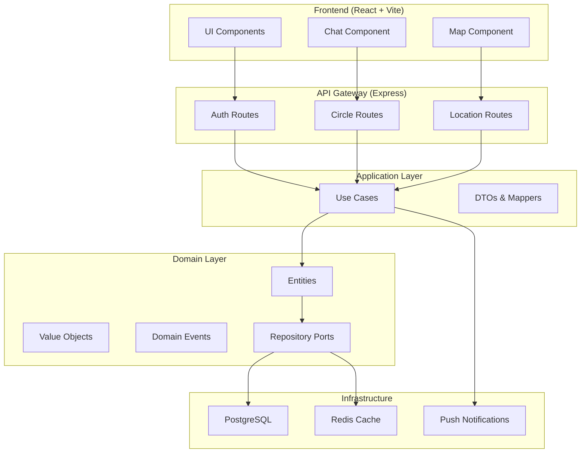

# Requirements Document — FamilyLink

## Introduction

FamilyLink es una aplicación de localización familiar que permite a grupos de usuarios (círculos familiares) compartir su ubicación de forma voluntaria y controlada. La aplicación sigue una arquitectura hexagonal con Domain-Driven Design (DDD), separando claramente el dominio de negocio de la infraestructura técnica.

Las funcionalidades principales incluyen: autenticación con roles diferenciados, gestión de círculos familiares, compartición de ubicación bajo demanda (sin GPS continuo), zonas dibujables con colores personalizables, notificaciones de entrada/salida de zonas, modo privacidad para pausar temporalmente el seguimiento, y límites diarios de compartición por rol.

**Stack tecnológico:**
- Frontend: React + TypeScript + Vite
- Backend: Node.js + Express
- Base de datos: PostgreSQL
- Arquitectura: Hexagonal + DDD

---

## Architecture Overview

---

## Glossary

### Términos de dominio (FamilyLink)

- **Sistema**: La aplicación FamilyLink en su conjunto (frontend + backend).
- **Auth_Service**: Servicio de dominio responsable de autenticación y autorización.
- **User**: Entidad de dominio que representa a un usuario registrado en el sistema.
- **Circle**: Entidad de dominio que representa un círculo familiar (grupo de usuarios).
- **Circle_Admin**: Rol de usuario con permisos de administración sobre un círculo (crear, invitar, configurar zonas, establecer límites).
- **Circle_Member**: Rol de usuario con permisos de participación en un círculo (compartir ubicación, activar modo privacidad).
- **Location_Service**: Servicio de dominio responsable de gestionar las actualizaciones de ubicación.
- **Location_Update**: Evento de dominio que representa una actualización puntual de la ubicación de un usuario.
- **Zone**: Entidad de dominio que representa una zona geográfica delimitada dibujada sobre un mapa, con color personalizable.
- **Zone_Service**: Servicio de dominio responsable de evaluar si una ubicación está dentro o fuera de una zona.
- **Notification_Service**: Servicio de dominio responsable de emitir notificaciones a los miembros del círculo.
- **Privacy_Mode**: Estado de dominio en el que un usuario ha pausado temporalmente la compartición de su ubicación.
- **Daily_Limit**: Restricción de dominio que define el número máximo de actualizaciones de ubicación que un rol puede realizar en un día.
- **Invitation**: Entidad de dominio que representa una invitación pendiente para unirse a un círculo.
- **Token**: Artefacto de autenticación (JWT) emitido por el Auth_Service tras un inicio de sesión exitoso.

### Términos DDD / Arquitectura Hexagonal

- **Value Object**: Objeto inmutable que se define por sus atributos, no por su identidad (ej. `Coordinates`, `Email`, `ColorHex`). No tiene ID propio; dos Value Objects con los mismos atributos son considerados iguales.
- **Aggregate**: Grupo de entidades y Value Objects que se tratan como una unidad transaccional. El agregado raíz (Aggregate Root) es la única puerta de entrada para modificar el estado interno del grupo (ej. `Circle` como raíz que contiene sus miembros y zonas).
- **Domain Event**: Evento del negocio que ha ocurrido y que puede disparar acciones en otros agregados o servicios (ej. `UserEnteredZoneEvent`, `PrivacyModeActivatedEvent`). Son inmutables y representan hechos pasados.
- **Port**: Interfaz definida en la capa de dominio que especifica cómo interactuar con servicios externos, sin conocer su implementación concreta (ej. `IZoneRepository`, `INotificationService`).
- **Adapter**: Implementación concreta de un Port en la capa de infraestructura que conecta el dominio con tecnologías específicas (ej. `PostgresZoneRepository` implementa `IZoneRepository`).
- **Repository**: Patrón para acceder y persistir agregados desde la capa de infraestructura. Se define como Port en el dominio y se implementa como Adapter en infraestructura (ej. `ICircleRepository` → `PostgresCircleRepository`).
- **Use Case**: Clase en la capa de aplicación que orquesta la ejecución de una operación de negocio coordinando entidades, servicios de dominio y ports (ej. `CreateCircleUseCase`, `ShareLocationUseCase`).

---

## Requirements

---

### Requirement 1: Registro de usuarios

**User Story:** Como visitante, quiero registrarme en FamilyLink con mi correo electrónico y contraseña, para poder acceder a las funcionalidades de la aplicación.

#### Acceptance Criteria

1. WHEN un visitante envía un formulario de registro con correo electrónico, contraseña y nombre de usuario válidos, THE Auth_Service SHALL crear una cuenta de User y emitir un Token de sesión.
2. WHEN un visitante intenta registrarse con un correo electrónico ya existente en el sistema, THE Auth_Service SHALL rechazar el registro y devolver un mensaje de error que indique que el correo ya está en uso.
3. WHEN un visitante envía un formulario de registro con una contraseña de menos de 8 caracteres, THE Auth_Service SHALL rechazar el registro y devolver un mensaje de error que especifique el requisito mínimo de longitud.
4. WHEN un visitante envía un formulario de registro con un correo electrónico con formato inválido, THE Auth_Service SHALL rechazar el registro y devolver un mensaje de error que indique el formato esperado.
5. THE Auth_Service SHALL almacenar las contraseñas de los usuarios utilizando un algoritmo de hash con sal (bcrypt con factor de coste mínimo de 10).

---

### Requirement 2: Inicio de sesión

**User Story:** Como usuario registrado, quiero iniciar sesión con mis credenciales, para acceder a mi cuenta y a los círculos familiares a los que pertenezco.

#### Acceptance Criteria

1. WHEN un usuario envía credenciales válidas (correo y contraseña correctos), THE Auth_Service SHALL emitir un Token JWT con una validez de 24 horas y un refresh token con validez de 30 días.
2. WHEN un usuario envía credenciales inválidas, THE Auth_Service SHALL rechazar el inicio de sesión y devolver un mensaje de error genérico sin revelar cuál de los campos es incorrecto.
3. WHEN un usuario realiza 5 intentos de inicio de sesión fallidos consecutivos en un período de 15 minutos, THE Auth_Service SHALL bloquear temporalmente el acceso desde esa cuenta durante 15 minutos y notificar al usuario por correo electrónico.
4. WHEN un Token JWT expira y el usuario presenta un refresh token válido, THE Auth_Service SHALL emitir un nuevo Token JWT sin requerir que el usuario introduzca sus credenciales de nuevo.
5. WHEN un usuario cierra sesión, THE Auth_Service SHALL invalidar el refresh token activo del usuario.

---

### Requirement 3: Gestión de roles de usuario

**User Story:** Como usuario, quiero que el sistema reconozca mi rol dentro de cada círculo familiar, para que se apliquen los permisos y límites correspondientes a mi rol.

#### Acceptance Criteria

1. THE Sistema SHALL soportar exactamente dos roles dentro de un círculo: Circle_Admin y Circle_Member.
2. WHEN un usuario crea un nuevo círculo, THE Sistema SHALL asignar automáticamente el rol Circle_Admin a ese usuario dentro del círculo recién creado.
3. WHEN un Circle_Admin invita a un usuario a un círculo, THE Sistema SHALL asignar el rol Circle_Member al usuario invitado al aceptar la invitación.
4. WHEN un Circle_Admin intenta degradar su propio rol a Circle_Member siendo el único administrador del círculo, THE Sistema SHALL rechazar la operación y devolver un mensaje de error que indique que el círculo debe tener al menos un Circle_Admin.
5. WHEN un Circle_Admin asigna el rol Circle_Admin a un Circle_Member, THE Sistema SHALL actualizar el rol del usuario en el círculo y registrar el cambio con marca de tiempo y el identificador del Circle_Admin que realizó el cambio.

---

### Requirement 4: Gestión de círculos familiares

**User Story:** Como usuario, quiero crear y gestionar círculos familiares, para organizar a los miembros de mi familia en grupos con configuración propia.

#### Acceptance Criteria

1. WHEN un usuario autenticado envía una solicitud de creación de círculo con un nombre de entre 3 y 50 caracteres, THE Sistema SHALL crear el Circle y asignar al usuario como Circle_Admin.
2. WHEN un Circle_Admin envía una invitación a un correo electrónico registrado en el sistema, THE Sistema SHALL crear una Invitation con estado pendiente y enviar una notificación al usuario invitado.
3. WHEN un usuario acepta una Invitation pendiente, THE Sistema SHALL añadir al usuario como Circle_Member del círculo correspondiente e invalidar la Invitation.
4. WHEN una Invitation permanece en estado pendiente durante más de 7 días, THE Sistema SHALL invalidar automáticamente la Invitation y notificar al Circle_Admin que la emitió.
5. WHEN un Circle_Admin elimina a un Circle_Member del círculo, THE Sistema SHALL revocar el acceso del miembro a los datos del círculo de forma inmediata.
6. WHEN un Circle_Admin disuelve un círculo, THE Sistema SHALL eliminar todas las zonas, ubicaciones compartidas e invitaciones pendientes asociadas al círculo, y notificar a todos los Circle_Member.
7. THE Sistema SHALL permitir que un User pertenezca a un máximo de 10 círculos simultáneamente.
8. WHEN un Circle_Admin intenta invitar a un usuario que ya pertenece al círculo, THE Sistema SHALL rechazar la invitación y devolver un mensaje de error "El usuario ya es miembro de este círculo".
9. WHEN un usuario intenta unirse a un círculo mediante una invitación que expiró, THE Sistema SHALL rechazar la operación y devolver un mensaje de error "La invitación ha expirado. Solicita una nueva al administrador".

---

### Requirement 5: Compartición de ubicación bajo demanda

**User Story:** Como miembro de un círculo, quiero compartir mi ubicación puntualmente pulsando un botón, para que mi familia sepa dónde estoy sin necesidad de activar el GPS de forma continua.

#### Acceptance Criteria

1. WHEN un Circle_Member pulsa el botón de compartir ubicación, THE Location_Service SHALL capturar las coordenadas GPS actuales del dispositivo y crear un Location_Update con marca de tiempo.
2. WHEN el Location_Service crea un Location_Update, THE Sistema SHALL hacer visible la ubicación del Circle_Member a todos los miembros del mismo círculo en un plazo máximo de 5 segundos.
3. WHEN un Circle_Member intenta compartir su ubicación y el dispositivo no tiene acceso a los servicios de localización, THE Location_Service SHALL informar al usuario del error y no crear ningún Location_Update.
4. WHILE un User tiene el Privacy_Mode activo, THE Location_Service SHALL rechazar cualquier solicitud de compartición de ubicación de ese User y devolver un mensaje que indique que el modo privacidad está activo.
5. THE Location_Service SHALL conservar el historial de Location_Update de cada usuario durante un máximo de 30 días, eliminando automáticamente los registros más antiguos.
6. WHEN el dispositivo del usuario no tiene conexión a Internet en el momento de compartir ubicación, THE Location_Service SHALL guardar la ubicación en local y reintentar el envío cuando recupere la conexión.
7. WHEN un Location_Update contiene coordenadas inválidas (latitud fuera de [-90, 90] o longitud fuera de [-180, 180]), THE Location_Service SHALL rechazar la actualización y registrar un error en los logs.

---

### Requirement 6: Límites diarios de compartición por rol

**User Story:** Como Circle_Admin, quiero configurar límites diarios de compartición de ubicación por rol, para controlar la frecuencia con la que los miembros pueden compartir su posición.

#### Acceptance Criteria

1. THE Sistema SHALL aplicar un Daily_Limit de 50 actualizaciones de ubicación por día para el rol Circle_Member, salvo que el Circle_Admin configure un valor diferente.
2. THE Sistema SHALL aplicar un Daily_Limit de 200 actualizaciones de ubicación por día para el rol Circle_Admin, salvo que el Circle_Admin configure un valor diferente.
3. WHEN un Circle_Admin configura un Daily_Limit para un rol dentro de su círculo, THE Sistema SHALL aceptar únicamente valores enteros entre 1 y 500.
4. WHEN un User alcanza su Daily_Limit diario, THE Location_Service SHALL rechazar las solicitudes de compartición de ubicación posteriores hasta las 00:00 UTC del día siguiente, e informar al usuario del límite alcanzado.
5. WHEN el reloj del sistema alcanza las 00:00 UTC, THE Sistema SHALL reiniciar el contador de actualizaciones diarias de todos los usuarios.

---

### Requirement 7: Zonas dibujables

**User Story:** Como Circle_Admin, quiero dibujar zonas sobre un mapa y asignarles un color personalizable, para definir zonas de interés para mi círculo familiar.

#### Acceptance Criteria

1. WHEN un Circle_Admin dibuja un polígono sobre el mapa con un mínimo de 3 vértices y un máximo de 50 vértices, THE Sistema SHALL crear una Zone asociada al círculo con las coordenadas del polígono.
2. WHEN un Circle_Admin crea una Zone, THE Sistema SHALL requerir que se asigne un nombre de entre 1 y 100 caracteres y un color en formato hexadecimal (#RRGGBB).
3. WHEN un Circle_Admin actualiza el color de una Zone existente con un valor hexadecimal válido, THE Sistema SHALL persistir el nuevo color y reflejar el cambio en el mapa de todos los miembros del círculo en un plazo máximo de 10 segundos.
4. WHEN un Circle_Admin elimina una Zone, THE Sistema SHALL eliminar la zona y cancelar todas las notificaciones pendientes asociadas a ella.
5. THE Sistema SHALL permitir un máximo de 20 Zones activas por círculo.
6. IF un Circle_Admin intenta crear una Zone con un polígono cuya área sea inferior a 100 metros cuadrados, THEN THE Sistema SHALL rechazar la operación y devolver un mensaje de error que indique el área mínima requerida.

---

### Requirement 8: Notificaciones de entrada y salida de zonas

**User Story:** Como miembro de un círculo, quiero recibir notificaciones cuando un familiar entra o sale de una zona, para estar informado de sus movimientos en zonas relevantes.

#### Acceptance Criteria

1. WHEN el Zone_Service detecta que un Location_Update sitúa a un User dentro de una Zone en la que no estaba en su Location_Update anterior, THE Notification_Service SHALL emitir una notificación de entrada a todos los miembros del círculo en un plazo máximo de 10 segundos.
2. WHEN el Zone_Service detecta que un Location_Update sitúa a un User fuera de una Zone en la que sí estaba en su Location_Update anterior, THE Notification_Service SHALL emitir una notificación de salida a todos los miembros del círculo en un plazo máximo de 10 segundos.
3. WHILE un User tiene el Privacy_Mode activo, THE Zone_Service SHALL omitir la evaluación de zonas para ese User y no emitir notificaciones de entrada ni salida.
4. WHEN un Circle_Member desactiva las notificaciones de una Zone específica, THE Notification_Service SHALL suprimir las notificaciones de esa Zone únicamente para ese Circle_Member, sin afectar a los demás miembros del círculo.
5. THE Notification_Service SHALL soportar la entrega de notificaciones mediante push notifications en dispositivos móviles y mediante notificaciones en la interfaz web.
6. WHEN un Circle_Admin intenta crear una zona con un polígono que se auto-interseca (forma de 8 o lazo), THE Sistema SHALL rechazar la operación y devolver un mensaje de error "El polígono no es válido. Las líneas no pueden cruzarse".
7. WHEN un Location_Update se procesa mientras el Zone_Service está sobrecargado, THE Zone_Service SHALL procesar las actualizaciones en orden FIFO (first in, first out) y registrar la latencia en logs de monitorización.

---

### Requirement 9: Modo Privacidad

**User Story:** Como miembro de un círculo, quiero activar un modo privacidad que pause temporalmente el seguimiento de mi ubicación, para tener momentos de privacidad sin abandonar el círculo familiar.

#### Acceptance Criteria

1. WHEN un Circle_Member activa el Privacy_Mode, THE Sistema SHALL registrar la hora de activación y hacer visible a todos los miembros del círculo que ese usuario está en modo privacidad, sin revelar su ubicación.
2. WHEN un Circle_Member activa el Privacy_Mode con una duración específica de entre 15 minutos y 8 horas, THE Sistema SHALL desactivar automáticamente el Privacy_Mode al transcurrir la duración indicada.
3. WHEN la duración del Privacy_Mode expira, THE Sistema SHALL notificar al Circle_Member que el modo privacidad ha finalizado y que su ubicación puede volver a ser compartida.
4. WHEN un Circle_Member desactiva manualmente el Privacy_Mode antes de que expire la duración configurada, THE Sistema SHALL restablecer el estado de compartición normal de forma inmediata.
5. THE Sistema SHALL permitir que un Circle_Member active el Privacy_Mode un máximo de 5 veces por día dentro de un mismo círculo.
6. WHEN un Circle_Admin activa el Privacy_Mode, THE Sistema SHALL aplicar las mismas restricciones de privacidad que para un Circle_Member, sin excepciones por rol.

---

### Requirement 10: Visualización del mapa familiar

**User Story:** Como miembro de un círculo, quiero ver en un mapa la última ubicación conocida de los miembros de mi familia junto con las geocercas activas, para tener una visión clara de la situación del grupo.

#### Acceptance Criteria

1. WHEN un User autenticado accede a la vista de mapa de un círculo, THE Sistema SHALL mostrar la última Location_Update conocida de cada miembro del círculo que no tenga el Privacy_Mode activo.
2. THE Sistema SHALL renderizar todas las Zones activas del círculo sobre el mapa con el color hexadecimal asignado a cada una.
3. WHEN un User visualiza el mapa y un miembro del círculo comparte una nueva ubicación, THE Sistema SHALL actualizar el marcador de ese miembro en el mapa sin requerir que el User recargue la página.
4. WHEN un User visualiza el mapa y un miembro activa el Privacy_Mode, THE Sistema SHALL ocultar el marcador de ese miembro del mapa en un plazo máximo de 5 segundos.
5. THE Sistema SHALL mostrar el nombre del miembro y la marca de tiempo de su última ubicación conocida al seleccionar su marcador en el mapa.
6. WHEN un usuario tiene mala conexión a Internet y el mapa no puede cargar los marcadores, THE Sistema SHALL mostrar un mensaje amigable "Cargando ubicaciones..." y reintentar automáticamente cada 30 segundos.

---

### Requirement 11: Seguridad y privacidad de datos

**User Story:** Como usuario, quiero que mis datos de ubicación estén protegidos y solo sean accesibles por los miembros de mi círculo, para garantizar mi privacidad.

#### Acceptance Criteria

1. THE Sistema SHALL garantizar que un User solo puede acceder a los datos de ubicación de los miembros de los círculos a los que pertenece.
2. WHEN un User es eliminado de un círculo, THE Sistema SHALL revocar de forma inmediata el acceso de ese User a todos los Location_Update y Zones del círculo.
3. THE Sistema SHALL transmitir todos los datos de ubicación entre el cliente y el servidor mediante HTTPS con TLS 1.2 o superior.
4. THE Sistema SHALL almacenar las coordenadas de ubicación de los usuarios cifradas en reposo en la base de datos PostgreSQL.
5. WHEN un User solicita la eliminación de su cuenta, THE Sistema SHALL eliminar todos los Location_Update asociados a ese User en un plazo máximo de 30 días y notificar al usuario por correo electrónico cuando la eliminación se haya completado.

---

## Non-Functional Requirements

### Performance (Rendimiento)

| ID | Requisito |
|----|-----------|
| NFR-1 | El time-to-first-byte (TTFB) del API no excederá los 200ms para el 95% de las peticiones en condiciones normales. |
| NFR-2 | El mapa cargará y mostrará las ubicaciones iniciales en menos de 3 segundos con conexión 4G/LTE. |
| NFR-3 | La app soportará al menos 100 peticiones concurrentes por segundo sin degradación perceptible. |

### Disponibilidad y Resiliencia

| ID | Requisito |
|----|-----------|
| NFR-4 | El sistema tendrá una disponibilidad del 99.5% (tolerancia máxima de 3.6 horas de caída al mes en el peor caso). |
| NFR-5 | Si falla el servicio de notificaciones push, las notificaciones se reintentarán hasta 3 veces con backoff exponencial. |
| NFR-6 | Si la base de datos PostgreSQL falla, el sistema debe degradarse elegantemente (mostrar mensaje de mantenimiento, no crashear). |

### Seguridad (ampliación)

| ID | Requisito |
|----|-----------|
| NFR-7 | El sistema implementará rate limiting por IP: máximo 100 peticiones por minuto para endpoints no autenticados. |
| NFR-8 | Los logs del sistema no contendrán información sensible (contraseñas, tokens, coordenadas exactas). |
| NFR-9 | Las sesiones inactivas se cerrarán automáticamente tras 8 horas de inactividad. |

### Usabilidad

| ID | Requisito |
|----|-----------|
| NFR-10 | La interfaz será accesible según WCAG 2.1 nivel AA (contraste, tamaño de texto, navegación por teclado). |
| NFR-11 | La app tendrá modo oscuro/claro adaptable al tema del sistema operativo. |
| NFR-12 | El tutorial inicial no superará los 5 pasos y se podrá omitir. |

### Mantenibilidad

| ID | Requisito |
|----|-----------|
| NFR-13 | El 80% del código debe tener cobertura de tests unitarios (medido con Jest/Vitest). |
| NFR-14 | El 90% de las funciones críticas (autenticación, compartición de ubicación) deben tener tests de integración. |
| NFR-15 | El sistema generará documentación API automática con Swagger/OpenAPI en cada despliegue. |
| TST-1 | El sistema incluirá: (a) tests unitarios para todas las entidades y value objects del dominio; (b) tests de integración para los use cases principales (`CreateCircleUseCase`, `ShareLocationUseCase`); (c) tests end-to-end para el flujo crítico: registro → creación de círculo → invitación → compartición de ubicación → notificación. |

### Escalabilidad

| ID | Requisito |
|----|-----------|
| NFR-16 | La base de datos debe poder indexar consultas por `circle_id` y `timestamp` para búsquedas eficientes. |
| NFR-17 | El diseño debe permitir migrar fácilmente a microservicios en el futuro si es necesario. |

### Frontend y Compatibilidad

| ID | Requisito |
|----|-----------|
| NFR-18 | El frontend implementará lazy loading para los componentes pesados (mapa, chat) y code splitting por ruta (página de login, dashboard, configuración). Las imágenes y assets no críticos se cargarán con lazy loading nativo del navegador (`loading="lazy"`). |
| NFR-19 | La aplicación web será responsive y se verificará su funcionamiento dentro de un WebView (usando Capacitor o similar). El mapa y las notificaciones push deben funcionar correctamente en el contexto de WebView. |

---

## Restricción Global: Coste Cero

| ID | Requisito |
|----|-----------|
| COST-1 | THE Sistema SHALL utilizar exclusivamente herramientas, bibliotecas, APIs e infraestructura que dispongan de un plan gratuito perpetuo o de créditos iniciales suficientes para cubrir el desarrollo, las pruebas y la demostración del TFG, sin requerir ningún método de pago por parte del usuario o del evaluador. |

---

## Monitoring & Observability

| ID | Requisito |
|----|-----------|
| OBS-1 | El sistema expondrá una métrica `familylink_location_updates_total` que cuente el número de actualizaciones de ubicación por círculo y minuto. |
| OBS-2 | El sistema registrará en un log estructurado (JSON) cada operación de modificación de zona con: `user_id`, `circle_id`, `zone_id`, tipo de operación (crear/actualizar/eliminar), `timestamp`. |
| OBS-3 | El sistema enviará una alerta al administrador (por email o Discord webhook) si el número de errores 5xx supera el 1% de las peticiones en una ventana de 5 minutos. |
| OBS-4 | El tiempo medio de detección de entrada/salida de zona será monitorizable desde un dashboard (CloudWatch, Prometheus o similar). |

---

## Internationalisation (i18n)

| ID | Requisito |
|----|-----------|
| I18N-1 | La interfaz de usuario debe ser traducible al inglés y español al menos. |
| I18N-2 | El sistema detectará el idioma del navegador en el primer acceso y cargará las traducciones correspondientes. |
| I18N-3 | Las zonas podrán tener nombres en ambos idiomas (se mostrará el del idioma del usuario actual o un fallback al otro idioma disponible). |
